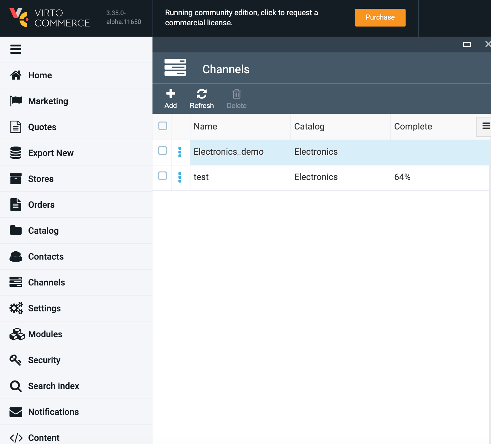
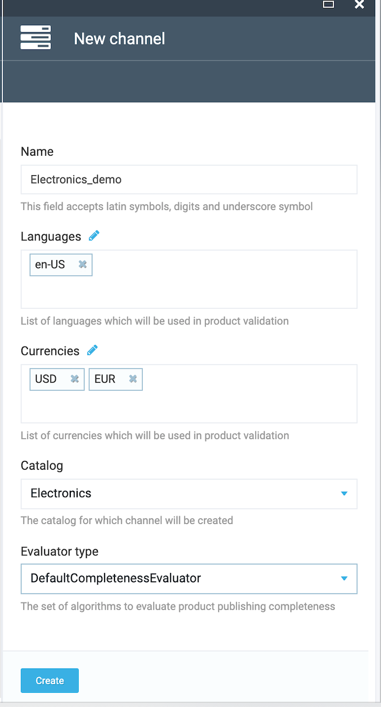
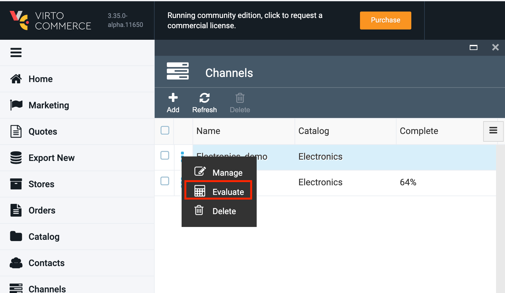
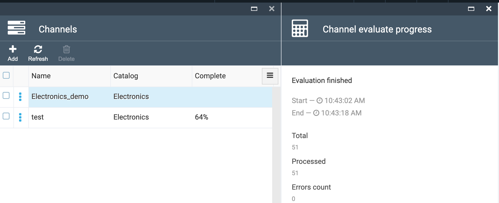
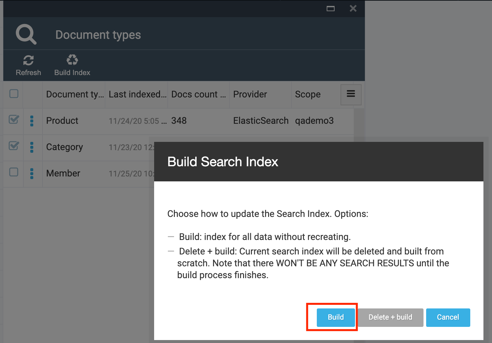
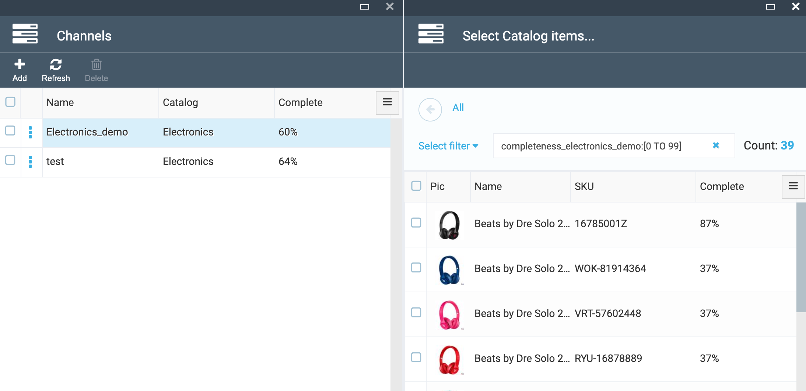
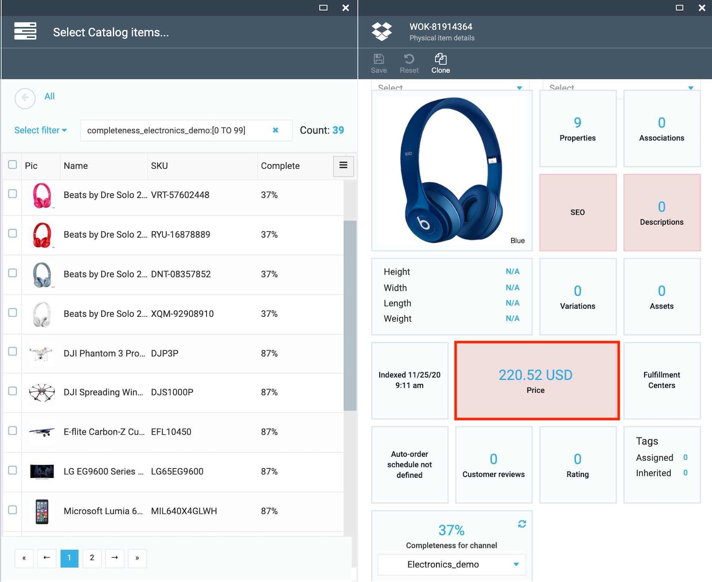

# Overview

Catalog Publishing Module is a set of tools for assessing the completeness of products for publication by specified criteria.

## Key Features

## Installation

1. Automatically: in VC Manager go to Configuration -> Modules -> Catalog publishing module -> Install

1. Manually: download module zip package from https://github.com/VirtoCommerce/vc-module-catalog-publishing/releases. In VC Manager go to Configuration -> Modules -> Advanced -> upload module package -> Install.

## Documentation

[Catalog Publishing Module Document](/docs/index.md)

[View on GitHub](https://github.com/VirtoCommerce/vc-module-catalog-publishing/tree/dev)

## References

1. Deploy: https://virtocommerce.com/docs/latest/developer-guide/deploy-module-from-source-code/

1. Installation: https://www.virtocommerce.com/docs/latest/user-guide/modules/

1. Home: https://virtocommerce.com

1. Community: https://www.virtocommerce.org

1. [Download Latest Release](https://github.com/VirtoCommerce/vc-module-catalog-publishing/releases/)

## Module configuration

### Create new channel of publication

1. Go to Configuration\Channels

1. Add new channel to calculate completeness percent by specified criteria

1. Define locales, currencies, catalog, evaluator type and create channel 

## Evaluating the completeness

1. Click "Evaluate" from sub-menu of the channel to calculate the completeness




1. Run "Build" to force the Catalog Search Index update

1. After that you can use search filters by range completeness in the catalog search





1. A reddish background indicates that the module is not filled completely



## Default completeness evaluation

Default completeness evaluator check the following statements:
1. All required properties of product has valid value (*per channel language* for multilingual properties), where valid value is:
    1. One of property *dictionary values* (for dictionary properties);
    2. For value of type `Short text` & `Long text`: *is not null or empty*;
    3. For value of type `Number`: *is greater than or equal to zero*;
    4. *Any* value successfully parsed as `Date time` or `Boolean` is valid;
2. Product has description *per item description type per channel language*, which content *is not null or empty*.
3. Product has at least one price *per channel currency*, which list price *is greater than zero*.
4. Product has at least one SEO *per channel language*, `URL keyword` of which *is not null or empty* and *does not contain invalid symbols* (where invalid symbols is `$+;=%{}[]|\/@ ~#!^*&?:'<>,`)

## Extensibility

This module provide multiple points of evaluation extensibility to allow fully customize this process. Possible user cases and solutions for them are listed below.

### Add new detail to default evaluation process

Inherit your detail evaluator from `DefaultCompletenessDetailEvaluator` class and override `EvaluateCompleteness` method:
```csharp
public class CustomCompletenessDetailEvaluator : DefaultCompletenessDetailEvaluator
{
    public override CompletenessDetail[] EvaluateCompleteness(CompletenessChannel channel, CatalogProduct[] products)
    {
    }
}
```
Register this class as implementation of `DefaultCompletenessDetailEvaluator` in Unity:
```csharp
_container.RegisterType<DefaultCompletenessDetailEvaluator, CustomCompletenessDetailEvaluator>(nameof(CustomCompletenessDetailEvaluator));
```
After that, default product completeness evaluator will include your detail evaluator in evaluation process.

## Define your own product completeness evaluator

If you want, you may create you own product completeness evaluator implementation by implemening `ICompletenessEvaluator` interface:
```csharp
public class CustomCompletenessEvaluator : ICompletenessEvaluator
{
    public CompletenessEntry[] EvaluateCompleteness(CompletenessChannel channel, CatalogProduct[] products)
    {
    }
}
```
... or customize default evaluation process by inheriting from `DefaultCompletenessEvaluator` class and overring `EvaluateCompleteness` method:
```csharp

public class CustomCompletenessEvaluator : DefaultCompletenessEvaluator
{
    public override CompletenessEntry[] EvaluateCompleteness(CompletenessChannel channel, CatalogProduct[] products)
    {
    }
}
```
In any case, you need to register your class as implementation of `ICompletenessEvaluator` in Unity:
```csharp
_container.RegisterType<ICompletenessEvaluator, CustomCompletenessEvaluator>(nameof(CustomCompletenessEvaluator));
```
After that, your product completeness evaluator will be available in module's RESTful API and UI.

In section below, we will consider only cases when you don't want *define your own* product completeness evaluation process (by creating your own implementation of `ICompletenessEvaluator` interface) and you want only *customize default* product completeness evaluation process used by your product completeness evaluator (inherit from `DefaultCompletenessEvaluator`). If you want to *define your own* product completeness evaluation process, then you may implement same extensibility logic as our:
```csharp
public class CustomCompletenessEvaluator : ICompletenessEvaluator
{
    protected IReadOnlyCollection<ICompletenessDetailEvaluator> DetailEvaluators { get; }
        
    public CustomCompletenessEvaluator(CustomCompletenessDetailEvaluator[] detailEvaluators, IItemService productService) :
        this(detailEvaluators as ICompletenessDetailEvaluator[], productService)
    {
    }

    protected CustomCompletenessEvaluator(ICompletenessDetailEvaluator[] detailEvaluators, IItemService productService)
    {
        _productService = productService;
        DetailEvaluators = detailEvaluators;
    }
        
    public virtual CompletenessEntry[] EvaluateCompleteness(CompletenessChannel channel, CatalogProduct[] products)
    {
    }
}
```
## Define your own product completeness evaluator

### ... with default detail evaluators

Inject `DefaultCompletenessDetailEvaluator` array to your constructor and pass it to protected constructor of `DefaultCompletenessEvaluator` base class:
```csharp
public class CustomCompletenessEvaluator : DefaultCompletenessEvaluator
{
    private readonly IItemService _productService;

    public CustomCompletenessEvaluator(DefaultCompletenessDetailEvaluator[] detailEvaluators, IItemService productService) :
        base(detailEvaluators as ICompletenessDetailEvaluator[], productService)
    {
    }
}
```
### ... with custom detail evaluators
Create your own (possible, abstract) base class for detail evaluators and inherit all your detail evaluators from it:
```csharp
public abstract class CustomCompletenessDetailEvaluator : ICompletenessDetailEvaluator
{
    public abstract CompletenessDetail[] EvaluateCompleteness(CompletenessChannel channel, CatalogProduct[] products);
}


public class CustomCompletenessDetailEvaluator1 : CustomCompletenessDetailEvaluator
{
    public override CompletenessDetail[] EvaluateCompleteness(CompletenessChannel channel, CatalogProduct[] products)
    {
    }
}


public class CustomCompletenessDetailEvaluator2 : CustomCompletenessDetailEvaluator
{
    public override CompletenessDetail[] EvaluateCompleteness(CompletenessChannel channel, CatalogProduct[] products)
    {
    }
}
```
Inject `CustomCompletenessDetailEvaluator` array to constructor of your product completeness evaluator and pass this array to protected constructor of `DefaultCompletenessEvaluator` base class:
```csharp
public class CustomCompletenessEvaluator : DefaultCompletenessEvaluator
{
    private readonly IItemService _productService;

    public CustomCompletenessEvaluator(CustomCompletenessDetailEvaluator[] detailEvaluators, IItemService productService) :
        base(detailEvaluators as ICompletenessDetailEvaluator[], productService)
    {
    }
}
```
Register your detail evaluators as implementation of `CustomCompletenessEvaluator` class in Unity:
```
_container.RegisterType<CustomCompletenessEvaluator, CustomCompletenessEvaluator1>(nameof(CustomCompletenessEvaluator1));
_container.RegisterType<CustomCompletenessEvaluator, CustomCompletenessEvaluator2>(nameof(CustomCompletenessEvaluator2));
```
### ... with both default and custom detail evaluators
Inject both `DefaultCompletenessDetailEvaluator` and `CustomCompletenessDetailEvaluator` arrays (see code above) and then concatenate them and pass this array to protected constructor of `DefaultCompletenessEvaluator` base class:

```csharp
public class CustomCompletenessEvaluator : DefaultCompletenessEvaluator
{
    private readonly IItemService _productService;

    public CustomCompletenessEvaluator(DefaultCompletenessDetailEvaluator[] defaultDetailEvaluators, CustomCompletenessDetailEvaluator[] customDetailEvaluators, IItemService productService) :
        base(defaultDetailEvaluators.Concat<ICompletenessDetailEvaluator>(customDetailEvaluators).ToArray(), productService)
    {
    }
}
```
### ... with some default and all custom detail evaluators
Create array of instances of default detail evaluators and inject `CustomCompletenessDetailEvaluator` arrays (see code above), then concatenate them and pass this array to protected constructor of `DefaultCompletenessEvaluator` base class:

```csharp
public class CustomCompletenessEvaluator : DefaultCompletenessEvaluator
{
    private readonly IItemService _productService;
    private readonly IPricingSearchService _pricingSearchService;

    public CustomCompletenessEvaluator(CustomCompletenessDetailEvaluator[] detailEvaluators, IItemService productService, IPricingSearchService pricingSearchService) :
        base(new[] { new PropertiesCompletenessDetailEvaluator(), new PricesCompletenessDetailEvaluator(pricingSearchService) }.Concat<ICompletenessDetailEvaluator>(customDetailEvaluators).ToArray(), productService)
    {
    }
}
```

## License
Copyright (c) Virto Solutions LTD.  All rights reserved.

Licensed under the Virto Commerce Open Software License (the "License"); you
may not use this file except in compliance with the License. You may
obtain a copy of the License at

http://virtocommerce.com/opensourcelicense

Unless required by applicable law or agreed to in writing, software
distributed under the License is distributed on an "AS IS" BASIS,
WITHOUT WARRANTIES OR CONDITIONS OF ANY KIND, either express or
implied.